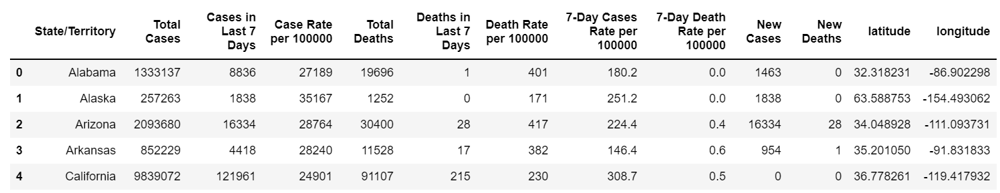
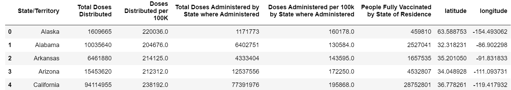
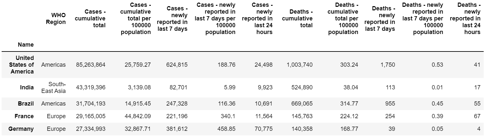
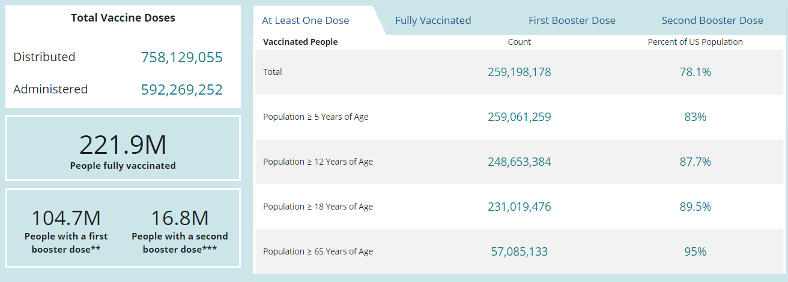

# Road Tripping Accross the United States

Group 6 Members: Sally Mei, Debolina Bhaumik, Cole Barnes, Kanu Madhok

## Topic Overview
Summer vacation time is here, but covid is still around. Trying to plan a road trip across the United States while keeping everyone’s health in 
mind can be tricky. Using the Covid Dashboard, users can easily identify which areas to avoid. 

To view deployed web appliciation visit:

In terms of covid19 deaths per state, users will be able to see new deaths, deaths last 7 days, deaths in last 7 days/100K, total deaths, and total deaths/100k.

For covid19 cases per state, users will be able to see new cases, cases last 7 days, cases in last 7 days/100K, total cases, and total cases/100k.

In terms of total doses administered per state, users will be able to see total doses administered, total doses adminstered rate (per 100K of total population), and people fully vaccinated.

For total doses distributed per state, users will be able to see total doses distributed, total doses distributed rate (per 100K of total population), and people fully vaccinated.

In addition, the Covid19 Global Counts of Cases & Deaths is included for users to see how the United States's counts of cases and deaths compare to others globally in general.

## Datasets
[WHO_Covid19_Global_Data](https://covid19.who.int/data)

[covid_cases](https://covid.cdc.gov/covid-data-tracker/#cases_casesper100klast7days)

[covid_vaccine](https://covid.cdc.gov/covid-data-tracker/#vaccinations_vacc-total-admin-rate-total)

[states_lat_long](https://developers.google.com/public-data/docs/canonical/states_csv)

## Data Cleaning/Manipulation & Conversion
The vlookup formula was used to find and place the latitude and longitude from the [states_lat_long](Resources/states_lat_long.csv) file into the [covid_cases](Resources/covid_cases.csv) and [covid_vaccine](Resources/covid_vaccine.csv) files.

Pandas was used for data cleaning/manipulation and conversion. 

Certain columns were selected from the [merged_covid_cases](Resources/merged_covid_cases.csv) and [merged_covid_vaccine](Resources/merged_covid_vaccine.csv) files to be placed into 2 separate dataframes and saved as csv files.

Also, rows with data for territories were dropped/ excluded since we are only focusing on covid-19 in the states and wanted to use the states' data specifically for our leaflet map.

cleaned_covid_case dataframe:

cleaned_covid_vaccine dataframe:

The [WHO_Covid19_Global_Data](Resources/WHO_COVID19_Global_Data.csv) file was extracted into a dataframe and the data was saved as a html file after setting the "name" column as the index.

WHO_Covid19_Global_Data dataframe:

## Webscraping
The data in the dashboard in the [covid_vaccine](https://covid.cdc.gov/covid-data-tracker/#vaccinations_vacc-total-admin-rate-total) website was webscraped and placed into MongoDB. Flask was used to pull the data from MongoDB into the index.html for display. 

