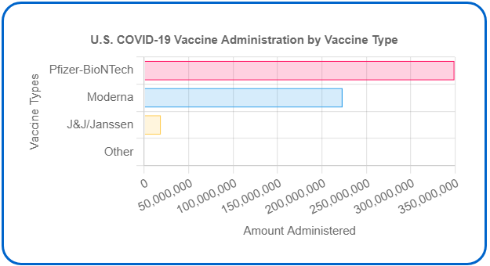
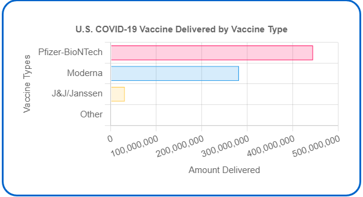

# Road Tripping Accross the United States

Group 6 Members: Sally Mei, Debolina Bhaumik, Cole Barnes, Kanu Madhok

## Topic Overview
Summer vacation time is here, but covid is still around. Trying to plan a road trip across the United States while keeping everyone’s health in 
mind can be tricky. Using the Covid Dashboard, users can easily identify which areas to avoid. 

To view deployed web appliciation visit:

As users hover over and click on a state in the map, the map zooms in on the state and the following information appears:  

- In terms of covid19 deaths per state, users will be able to see new deaths, deaths last 7 days, deaths in last 7 days/100K, total deaths, and total deaths/100k

- For covid19 cases per state, users will be able to see new cases, cases last 7 days, cases in last 7 days/100K, total cases, and total cases/100k

- In terms of total doses administered per state, users will be able to see total doses administered, total doses adminstered rate (per 100K of total population), and people fully vaccinated

- For total doses distributed per state, users will be able to see total doses distributed, total doses distributed rate (per 100K of total population), and people fully vaccinated

In addition, the Covid-19 Global Counts of Cases & Deaths is included for users to see how the United States' counts of cases and deaths compare to others globally in general.

Also, users can view more Covid-19 data by clicking on the dropdown menu on the right of the navbar named "More Covid-19 Data" which provides links to the CDC Covid-19 Data Tracker and WHO Covid-19 Dashboard websites.

## Datasets
[WHO_Covid19_Global_Data](https://covid19.who.int/data)

[covid_cases](https://covid.cdc.gov/covid-data-tracker/#cases_casesper100klast7days)

[covid_vaccine](https://covid.cdc.gov/covid-data-tracker/#vaccinations_vacc-total-admin-rate-total)

[states_lat_long](https://developers.google.com/public-data/docs/canonical/states_csv)

## Data Cleaning/Manipulation & Conversion
The vlookup formula was used to find and place the latitude and longitude from the [states_lat_long](Resources/states_lat_long.csv) file into the [covid_cases](Resources/covid_cases.csv) and [covid_vaccine](Resources/covid_vaccine.csv) files.

Pandas was used for data cleaning/manipulation and conversion. 

Certain columns were selected from the [merged_covid_cases](Resources/merged_covid_cases.csv) and [merged_covid_vaccine](Resources/merged_covid_vaccine.csv) files to be placed into 2 separate dataframes and saved as csv files.

Also, rows with data for territories were dropped/ excluded since we are only focusing on covid-19 in the states and wanted to use the states' data specifically for our leaflet map.

cleaned_covid_case dataframe:

cleaned_covid_vaccine dataframe:

The [WHO_Covid19_Global_Data](Resources/WHO_COVID19_Global_Data.csv) file was extracted into a dataframe and the data was saved as a html file after setting the "name" column as the index.

WHO_Covid19_Global_Data dataframe:

## Webscraping
The data in the dashboards in the [covid_cases](https://covid.cdc.gov/covid-data-tracker/#cases_casesper100klast7days) and [covid_vaccine](https://covid.cdc.gov/covid-data-tracker/#vaccinations_vacc-total-admin-rate-total) websites were webscraped and placed into MongoDB. Flask was used to pull the data from MongoDB into the index.html file for display. 

## Webpage Development
1. Name of the site on the left of the nav which allows users to return to the landing page from any page
2. Contains a dropdown menu on the right of the navbar named "More Covid-19 Data" that provides links to the CDC Covid-19 Data Tracker and WHO Covid-19 Dashboard websites.
3. Descriptive titles
4. Button that scrapes data from CDC website when clicked on 
5. The plots/visualizations  
6. Button that provides a link to the Global_Covid19_Data page
7. Responsive (using media queries)

## Leaflet Plot Creation
### Get the Data Set
1. The URL https://www.convertcsv.com/csv-to-geojson.htm  was used to convert the data in the [cleaned_covid_case](Resources/Cleaned_Files/cleaned_covid_case.csv) and [cleaned_covid_vaccine](Resources/Cleaned_Files/cleaned_covid_vaccine.csv) csv files to geojson files. 
2. The converted data was used to pull in the data for the visualization.

### Import and Visualize the Data
1. A choropleth map using leaflet plots all of the states from the data set based on their longitude and latitude
2. Popups that provide Covid-19 information were included when the user hovers their mouse over a state
3. Map control feature for users to select which view they want to see on the maps
4. A legend was created to provide context for the map data

## Plotly Creation
Chart.js was used to create horizontal bar charts showing:
- U.S. COVID-19 Vaccine Administration by Vaccine Type

- U.S. COVID-19 Vaccine Delivered by Vaccine Type

